# ARSITEKTUR SISTEM SILAMAR

## AI-Powered Resume Analysis & Cover Letter Generator

---

## 1. OVERVIEW SISTEM

### 1.1 Deskripsi Sistem

SILAMAR (Sistem Intelligent Lamaran) adalah aplikasi web berbasis AI yang dirancang untuk membantu pencari kerja dalam:

- Mengoptimalkan resume berdasarkan deskripsi pekerjaan
- Menghasilkan cover letter yang dipersonalisasi
- Melacak status lamaran pekerjaan
- Menganalisis kesesuaian resume dengan lowongan pekerjaan

### 1.2 Tujuan Sistem

- Meningkatkan efektivitas lamaran kerja melalui analisis AI
- Memberikan rekomendasi perbaikan resume yang berbasis data
- Mengotomatisasi pembuatan cover letter yang relevan
- Menyediakan platform terpusat untuk manajemen lamaran kerja

---

## 2. ARSITEKTUR TINGKAT TINGGI

### 2.1 Architectural Pattern

Sistem menggunakan **Layered Architecture** dengan **Clean Architecture** principles, yang terdiri dari:

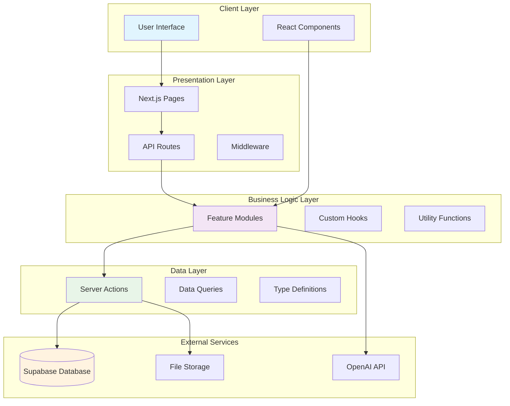

### 2.2 Technology Stack

| Layer            | Technology                         | Purpose                        |
| ---------------- | ---------------------------------- | ------------------------------ |
| Frontend         | Next.js 14, React, TypeScript      | User interface dan routing     |
| UI Framework     | Tailwind CSS, Radix UI             | Styling dan komponen UI        |
| State Management | React Hooks, Zustand               | State lokal dan global         |
| Backend          | Next.js API Routes, Server Actions | API endpoints dan server logic |
| Database         | PostgreSQL via Supabase            | Data persistence               |
| Authentication   | Supabase Auth                      | User management                |
| AI/ML            | OpenAI GPT-4o-mini                 | Natural language processing    |
| File Storage     | Supabase Storage                   | Resume dan dokumen             |
| Deployment       | Vercel                             | Hosting dan CI/CD              |

---

## 3. ARSITEKTUR KOMPONEN

### 3.1 Frontend Architecture

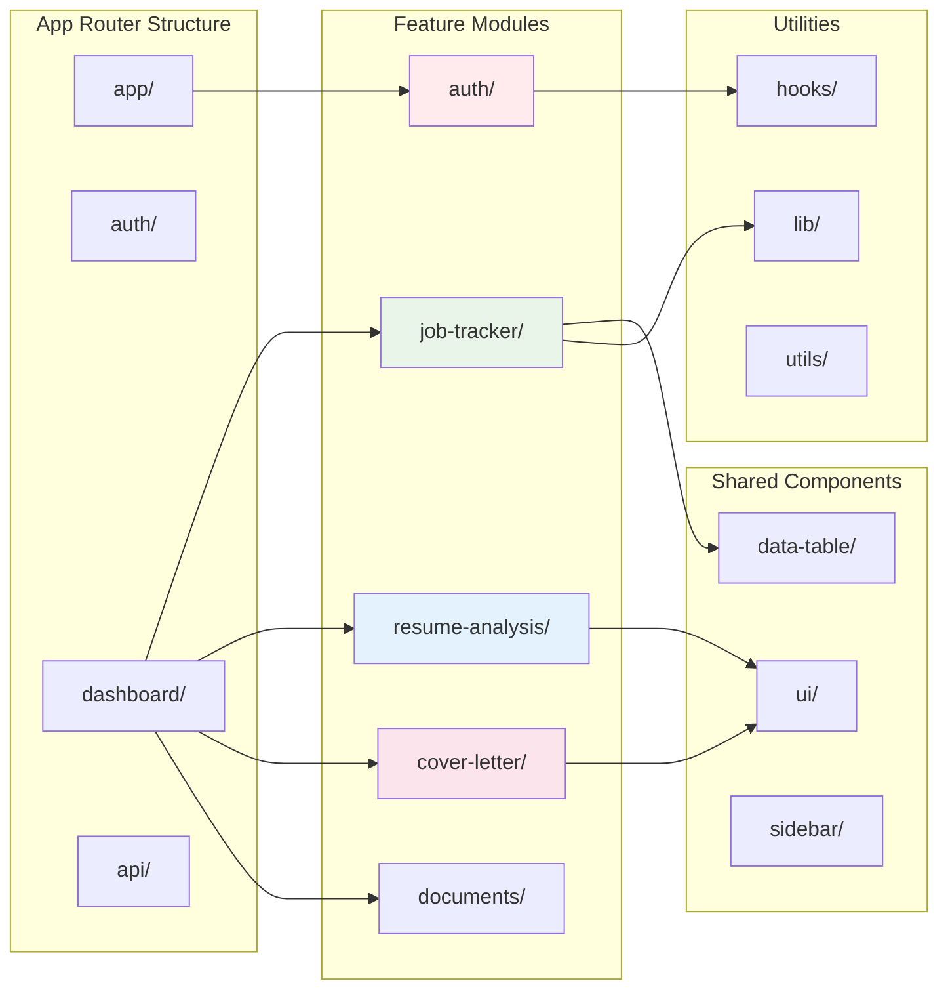

### 3.2 Feature Module Structure

Setiap feature module mengikuti struktur yang konsisten:

```
features/
├── auth/
│   ├── components/
│   ├── actions/
│   └── types/
├── job-tracker/
│   ├── components/
│   ├── schemas/
│   └── types/
├── resume-analysis/
│   ├── components/
│   ├── actions/
│   └── utils/
└── cover-letter/
    ├── components/
    ├── actions/
    └── schemas/
```

---

## 4. ARSITEKTUR DATA

### 4.1 Database Schema

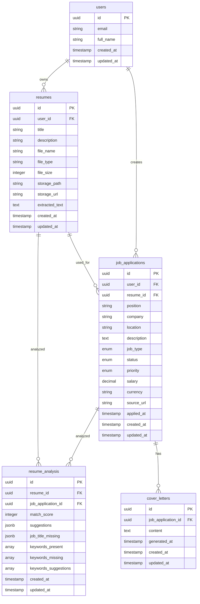

### 4.2 Data Types dan Enums

```typescript
// Job Status Enum
type JobStatus = "applied" | "interview" | "offer" | "rejected" | "accepted"

// Job Priority Enum
type JobPriority = "low" | "medium" | "high"

// Job Type Enum
type JobType =
  | "full_time"
  | "part_time"
  | "contract"
  | "temporary"
  | "internship"
  | "remote"
  | "hybrid"
  | "freelance"
```

---

## 5. ARSITEKTUR API

### 5.1 API Endpoints Structure

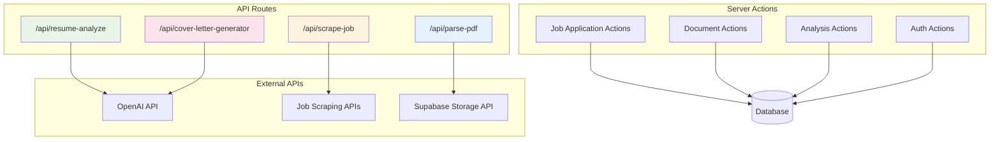

### 5.2 API Flow Patterns

#### Resume Analysis Flow

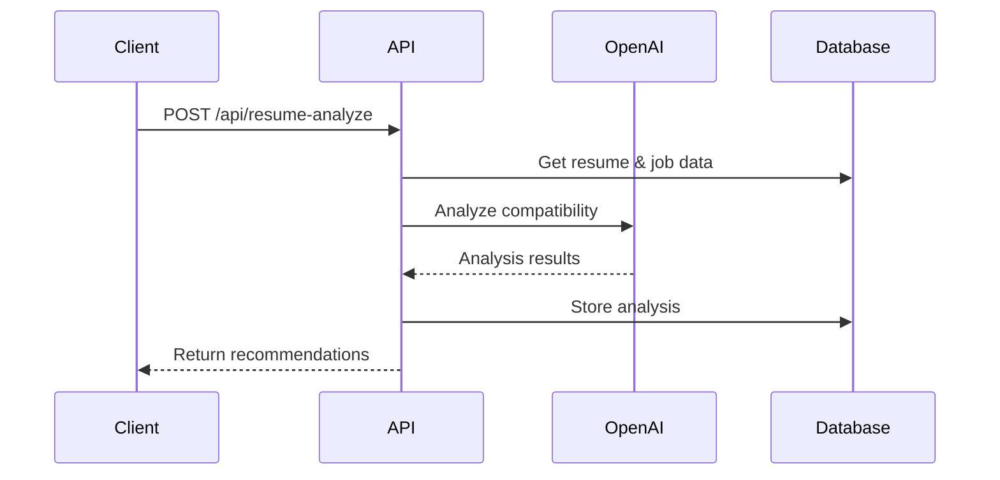

#### Cover Letter Generation Flow

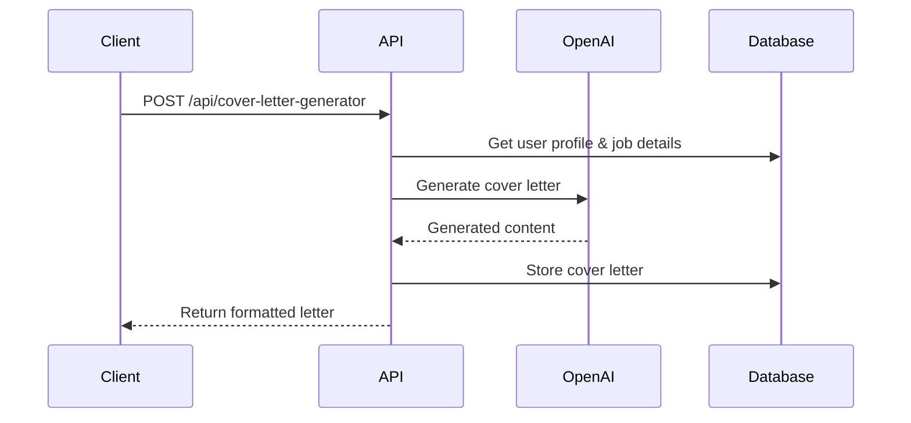

---

## 6. ARSITEKTUR KEAMANAN

### 6.1 Security Layers

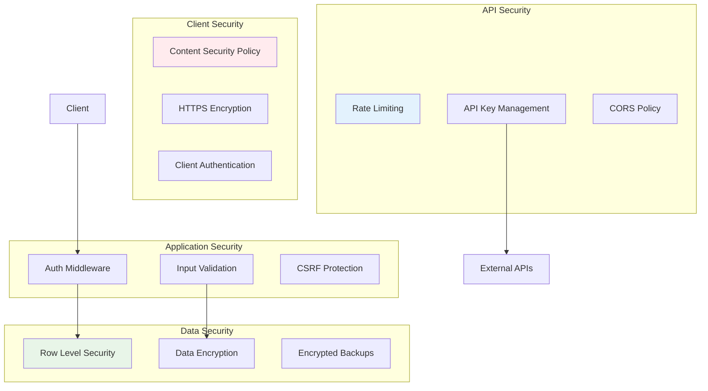

### 6.2 Authentication & Authorization

- **Authentication**: Supabase Auth dengan OAuth (Google, GitHub)
- **Authorization**: Row Level Security (RLS) policies
- **Session Management**: JWT tokens dengan refresh mechanism
- **API Protection**: Bearer token validation

---

## 7. ARSITEKTUR DEPLOYMENT

### 7.1 Deployment Architecture

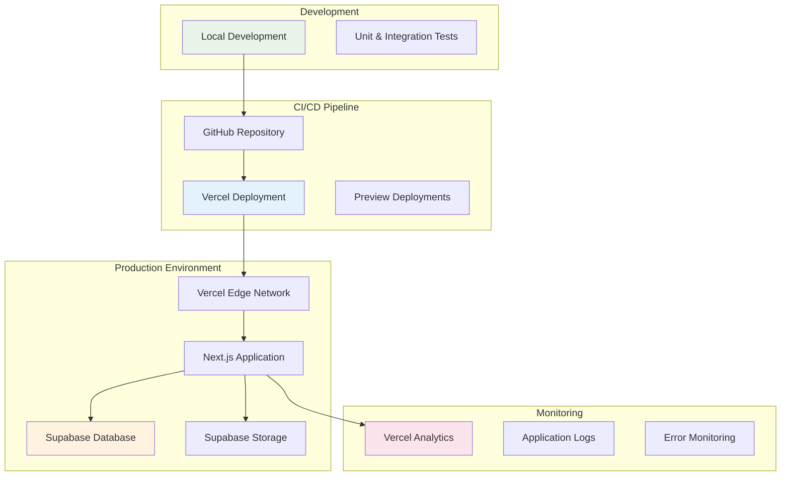

### 7.2 Environment Configuration

```typescript
// Environment Variables
interface Config {
  // Database
  NEXT_PUBLIC_SUPABASE_URL: string
  NEXT_PUBLIC_SUPABASE_ANON_KEY: string

  // AI Services
  OPENAI_API_KEY: string
  TOGETHER_AI_API_KEY: string

  // Application
  NEXT_PUBLIC_BASE_URL: string
  NODE_ENV: "development" | "production"
}
```

---

## 8. PERFORMANCE & SCALABILITY

### 8.1 Performance Optimizations

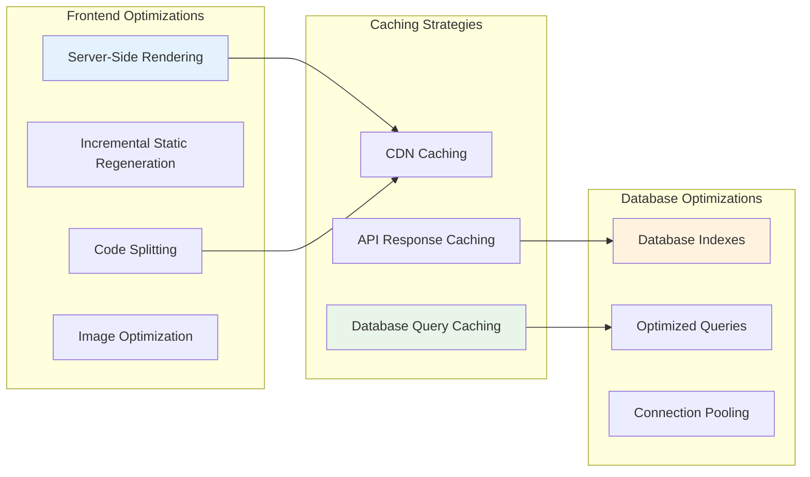

### 8.2 Scalability Considerations

- **Horizontal Scaling**: Vercel automatic scaling
- **Database Scaling**: Supabase managed PostgreSQL
- **File Storage**: CDN distribution
- **API Rate Limiting**: Per-user limits untuk external APIs

---

## 9. MONITORING & OBSERVABILITY

### 9.1 Monitoring Stack

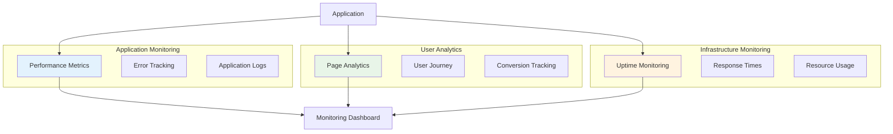

---

## 10. QUALITY ASSURANCE

### 10.1 Testing Strategy

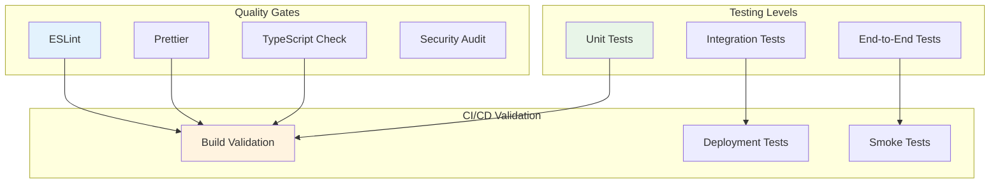

---

## 11. KESIMPULAN ARSITEKTUR

### 11.1 Keunggulan Arsitektur

1. **Modular Design**: Komponen terpisah untuk maintainability
2. **Scalable**: Dapat berkembang seiring pertumbuhan user
3. **Secure**: Multi-layer security implementation
4. **Performance**: Optimized untuk user experience
5. **Maintainable**: Clean code practices dan documentation

### 11.2 Design Patterns yang Digunakan

- **Repository Pattern**: Data access abstraction
- **Factory Pattern**: AI service initialization
- **Observer Pattern**: Real-time updates
- **Strategy Pattern**: Multiple AI providers support
- **Singleton Pattern**: Database connection management

### 11.3 Future Enhancements

- **Microservices**: Migration ke arsitektur microservices
- **GraphQL**: API layer optimization
- **Machine Learning**: Custom ML models untuk analysis
- **Real-time**: WebSocket untuk live updates
- **Mobile**: React Native mobile application

---

_Dokumentasi ini menjelaskan arsitektur sistem SILAMAR secara komprehensif untuk keperluan skripsi dan pengembangan lebih lanjut._
