# Business Process Model and Notation (BPMN) - SILAMAR Application

## Overview

SILAMAR adalah aplikasi AI-powered yang membantu pencari kerja dalam mengelola lamaran pekerjaan, mengoptimalkan resume, dan membuat cover letter yang disesuaikan dengan deskripsi pekerjaan tertentu.

---

## 1. RESUME UPLOAD ACTIVITY - Business Process

### 1.1 Process Overview

Proses upload dan validasi dokumen resume dalam format PDF dengan parsing otomatis untuk ekstraksi konten.

### 1.2 BPMN Diagram

```mermaid
flowchart LR
    Start([Start]) --> SelectFile[👤 Select PDF File]
    SelectFile --> ValidateFile{Valid PDF?}

    ValidateFile -->|No| FileError[⚠️ File Error]
    ValidateFile -->|Yes| UploadFile[📤 Upload to Storage]

    UploadFile --> ParsePDF[🔧 Parse PDF Content]
    ParsePDF --> ExtractText[📄 Extract Text]
    ExtractText --> SaveRecord[(💾 Save Resume Record)]
    SaveRecord --> Success[✅ Upload Success]
    Success --> End([Complete])

    FileError --> SelectFile
    ParsePDF -.->|Parse Failed| ParseError[⚠️ Parse Error]
    ParseError -.-> SelectFile

    %% Styling
    classDef startEnd fill:#e8f4fd,stroke:#1976d2,stroke-width:2px
    classDef process fill:#f3e5f5,stroke:#7b1fa2,stroke-width:2px
    classDef service fill:#e8f5e8,stroke:#388e3c,stroke-width:2px
    classDef data fill:#e1f5fe,stroke:#0277bd,stroke-width:2px
    classDef decision fill:#fafafa,stroke:#616161,stroke-width:2px
    classDef error fill:#ffebee,stroke:#d32f2f,stroke-width:1px,stroke-dasharray: 5 5

    class Start,End startEnd
    class SelectFile,Success process
    class UploadFile,ParsePDF,ExtractText service
    class SaveRecord data
    class ValidateFile decision
    class FileError,ParseError error
```

### 1.3 Key Process Steps

1. **File Selection**: User selects PDF resume file
2. **File Validation**: System validates PDF format and size
3. **Upload to Storage**: File uploaded to Supabase storage
4. **PDF Parsing**: Extract text content using PDF parser
5. **Save Record**: Store resume metadata in database

---

## 2. AI COVER LETTER GENERATION - Business Process

### 2.1 Process Overview

Proses pembuatan cover letter otomatis menggunakan AI berdasarkan data resume dan deskripsi pekerjaan.

### 2.2 BPMN Diagram

```mermaid
flowchart LR
    Start([Start]) --> CheckData{Resume & Job Data Exists?}
    CheckData -->|No| InputData[👤 Input Required Data]
    CheckData -->|Yes| CheckPrevious{Previous Cover Letter?}

    InputData --> ValidateData{Data Valid?}
    ValidateData -->|No| InputData
    ValidateData -->|Yes| CheckPrevious

    CheckPrevious -->|Yes| ShowPrevious[📋 Show Previous]
    CheckPrevious -->|No| AIGenerate[🤖 AI Generation]

    ShowPrevious --> Regenerate{Regenerate?}
    Regenerate -->|Yes| AIGenerate
    Regenerate -->|No| UserActions[📝 User Actions]

    AIGenerate --> FormatLetter[📄 Format Letter]
    FormatLetter --> SaveDB[(💾 Save to Database)]
    SaveDB --> UserActions
    UserActions --> End([Complete])

    %% Error Handling
    AIGenerate -.->|Failed| AIError[⚠️ AI Error]
    AIError -.-> InputData

    %% Styling
    classDef startEnd fill:#e8f4fd,stroke:#1976d2,stroke-width:2px
    classDef process fill:#f3e5f5,stroke:#7b1fa2,stroke-width:2px
    classDef ai fill:#fff3e0,stroke:#f57c00,stroke-width:2px
    classDef service fill:#e8f5e8,stroke:#388e3c,stroke-width:2px
    classDef data fill:#e1f5fe,stroke:#0277bd,stroke-width:2px
    classDef decision fill:#fafafa,stroke:#616161,stroke-width:2px
    classDef error fill:#ffebee,stroke:#d32f2f,stroke-width:1px,stroke-dasharray: 5 5

    class Start,End startEnd
    class InputData,ShowPrevious,UserActions process
    class AIGenerate ai
    class FormatLetter service
    class SaveDB data
    class CheckData,ValidateData,CheckPrevious,Regenerate decision
    class AIError error
```

### 2.3 Key Process Steps

1. **Data Check**: Verify resume and job data availability
2. **Input Data**: User provides missing job details
3. **AI Generation**: GPT-4o-mini creates personalized cover letter
4. **Format Letter**: Apply business letter formatting
5. **Save & Actions**: Store result and provide user options

---

## 3. TARGETED RESUME ANALYSIS - Business Process

### 3.1 Process Overview

Proses analisis resume yang ditargetkan untuk posisi pekerjaan tertentu menggunakan AI untuk memberikan rekomendasi peningkatan.

### 3.2 BPMN Diagram

### 3.3 Key Process Steps

1. **Upload Resume**: User uploads resume document
2. **Input Job Details**: User provides job description and requirements
3. **AI Analysis**: System analyzes resume against job requirements
4. **Keyword Matching**: Extract and match relevant keywords
5. **Score Calculation**: Calculate compatibility percentage
6. **Generate Suggestions**: AI provides improvement recommendations
7. **Display Results**: Show analysis with actionable insights

---

## 4. JOB APPLICATION MANAGEMENT - Business Process

### 4.1 Process Overview

Sistem manajemen lamaran pekerjaan yang komprehensif dengan fitur tracking status dan integrasi dengan fitur lainnya.

### 4.2 BPMN Diagram

```mermaid
flowchart LR
    Start([Start]) --> UserChoice{Action Type?}

    UserChoice -->|Add Job| AddMethod{Add Method?}
    UserChoice -->|View/Edit| ViewJob[📝 View Job Details]
    UserChoice -->|Track Status| UpdateStatus[📊 Update Status]

    AddMethod -->|Manual| ManualForm[👤 Fill Manual Form]
    AddMethod -->|URL| URLInput[👤 Enter Job URL]

    ManualForm --> ValidateManual{Valid Data?}
    ValidateManual -->|No| ManualForm
    ValidateManual -->|Yes| SaveJob[(💾 Save Job)]

    URLInput --> ValidateURL{Valid URL?}
    ValidateURL -->|No| URLInput
    ValidateURL -->|Yes| ScrapeJob[🤖 Scrape Data]
    ScrapeJob --> AutoFill[📝 Auto-fill Form]
    AutoFill --> SaveJob

    ViewJob --> EditFields[✏️ Edit Fields]
    EditFields --> AutoSave[(💾 Auto-save)]

    UpdateStatus --> StatusChange[📈 Change Status]
    StatusChange --> AutoSave

    SaveJob --> Success[✅ Success]
    AutoSave --> Success
    Success --> End([Complete])

    %% Error Handling
    ScrapeJob -.->|Failed| ScrapeError[⚠️ Scraping Error]
    ScrapeError -.-> URLInput

    %% Styling
    classDef startEnd fill:#e8f4fd,stroke:#1976d2,stroke-width:2px
    classDef process fill:#f3e5f5,stroke:#7b1fa2,stroke-width:2px
    classDef ai fill:#fff3e0,stroke:#f57c00,stroke-width:2px
    classDef service fill:#e8f5e8,stroke:#388e3c,stroke-width:2px
    classDef data fill:#e1f5fe,stroke:#0277bd,stroke-width:2px
    classDef decision fill:#fafafa,stroke:#616161,stroke-width:2px
    classDef error fill:#ffebee,stroke:#d32f2f,stroke-width:1px,stroke-dasharray: 5 5

    class Start,End startEnd
    class ManualForm,URLInput,ViewJob,EditFields,UpdateStatus,StatusChange,Success process
    class ScrapeJob ai
    class AutoFill service
    class SaveJob,AutoSave data
    class UserChoice,AddMethod,ValidateManual,ValidateURL decision
    class ScrapeError error
```

### 4.3 Key Process Steps

1. **Action Selection**: User chooses add, view/edit, or track status
2. **Job Addition**: Manual entry or URL scraping from job platforms
3. **Data Validation**: Ensure required fields are completed
4. **Auto-save**: Real-time saving for all changes
5. **Status Tracking**: Update application progress through hiring stages
6. **Integration**: Connect with resume analysis and cover letter features

---

## 5. INTEGRATED WORKFLOW - Cross-Feature Process

### 5.1 Complete User Journey

### 5.2 System Integration Points

- **Resume Upload** → **Targeted Analysis** → **Cover Letter Generation**
- **Job Management** → **Status Tracking** → **Progress Monitoring**
- **Cross-feature data sharing** via PostgreSQL database
- **AI-powered insights** across all modules

---

## 6. TECHNICAL SPECIFICATIONS

### 6.1 Technology Stack

- **Frontend**: Next.js 14, React, TypeScript, Tailwind CSS
- **Backend**: Next.js API Routes, Server Actions
- **Database**: PostgreSQL via Supabase
- **AI/ML**: OpenAI GPT-4o-mini
- **File Storage**: Supabase Storage
- **Authentication**: Supabase Auth

### 6.2 Key Features

- **PDF Processing**: Automatic text extraction and parsing
- **AI Analysis**: Intelligent resume-job matching
- **Web Scraping**: JobStreet and LinkedIn integration
- **Real-time Updates**: Auto-save and live status tracking
- **Data Security**: Encrypted storage and secure API calls

---

_This BPMN documentation provides a structured overview of the four main business processes in the SILAMAR application for academic thesis purposes._
