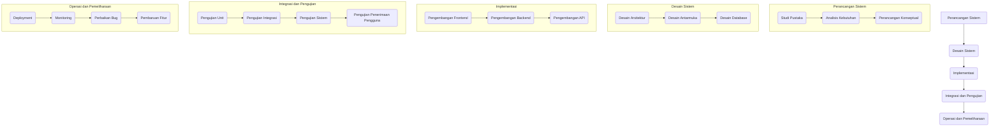

```mermaid
graph TD
    A[Perancangan Sistem] --> B(Desain Sistem);
    B --> C(Implementasi);
    C --> D(Integrasi dan Pengujian);
    D --> E(Operasi dan Pemeliharaan);

    subgraph Perancangan Sistem
        A1(Studi Pustaka)
        A2(Analisis Kebutuhan)
        A3(Perancangan Konseptual)
    end

    subgraph Desain Sistem
        B1(Desain Arsitektur)
        B2(Desain Antarmuka)
        B3(Desain Database)
    end

    subgraph Implementasi
        C1(Pengembangan Frontend)
        C2(Pengembangan Backend)
        C3(Pengembangan API)
    end

    subgraph Integrasi dan Pengujian
        D1(Pengujian Unit)
        D2(Pengujian Integrasi)
        D3(Pengujian Sistem)
        D4(Pengujian Penerimaan Pengguna)
    end
    
    subgraph Operasi dan Pemeliharaan
        E1(Deployment)
        E2(Monitoring)
        E3(Perbaikan Bug)
        E4(Pembaruan Fitur)
    end

    A1 --> A2;
    A2 --> A3;
    
    B1 --> B2;
    B2 --> B3;

    C1 --> C2;
    C2 --> C3;

    D1 --> D2;
    D2 --> D3;
    D3 --> D4;

    E1 --> E2;
    E2 --> E3;
    E3 --> E4;
```
