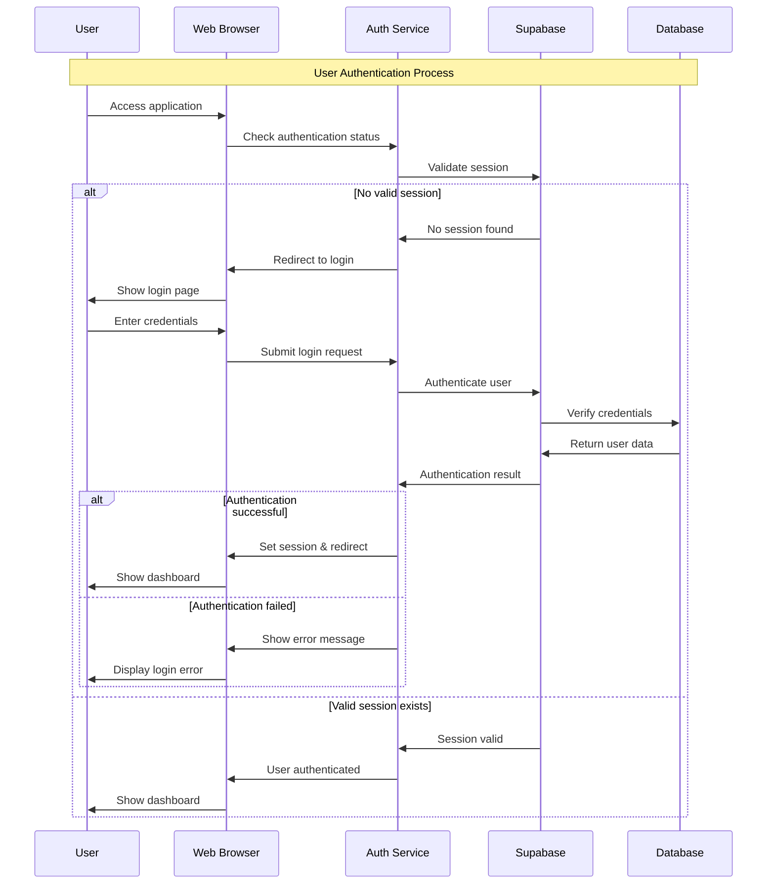
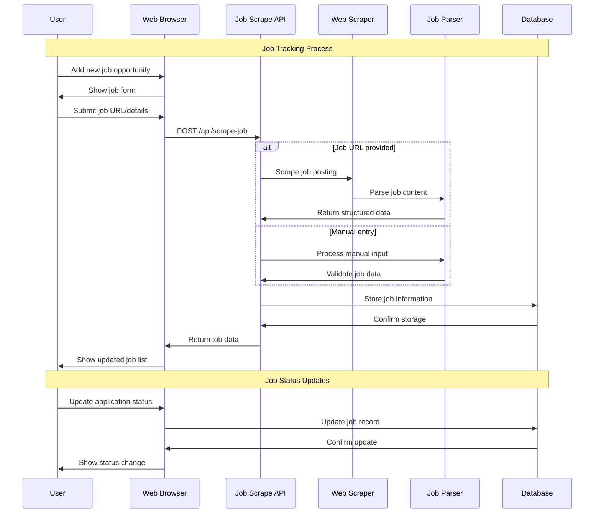
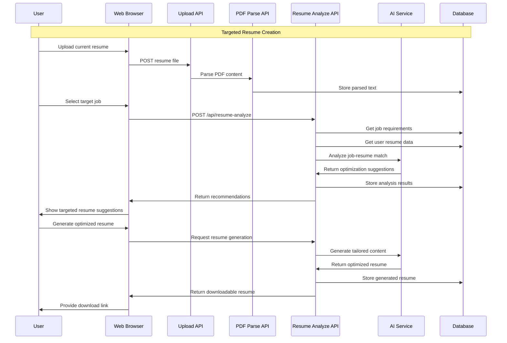
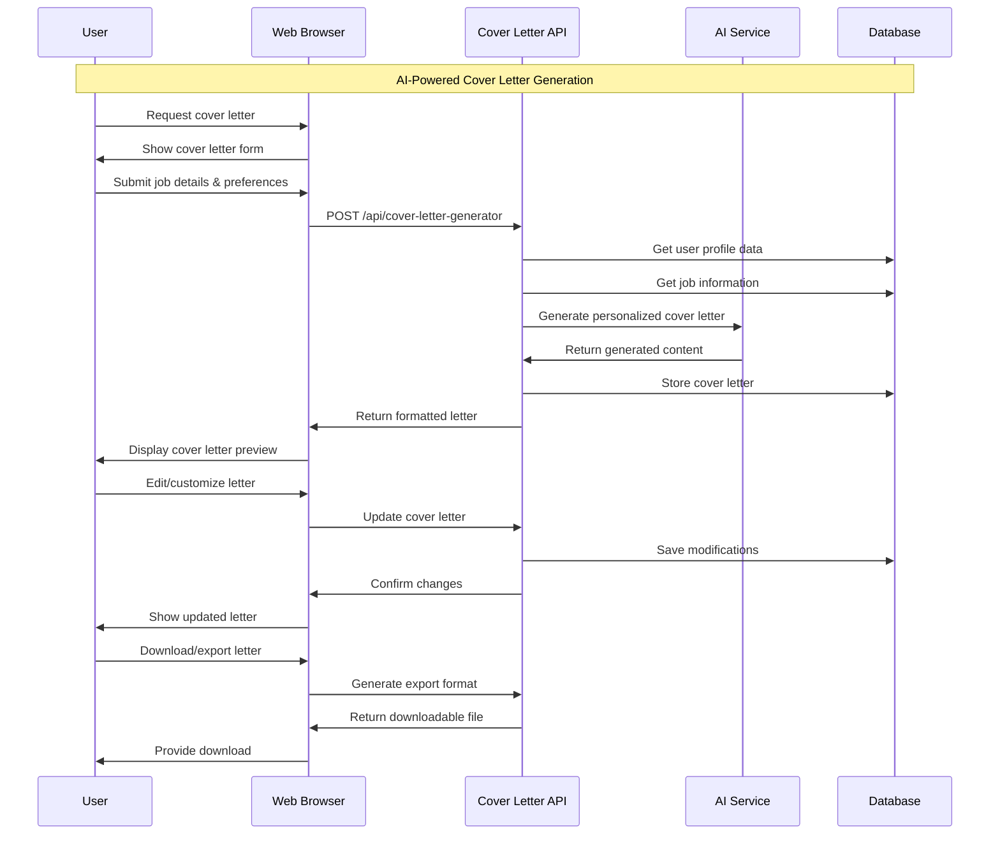
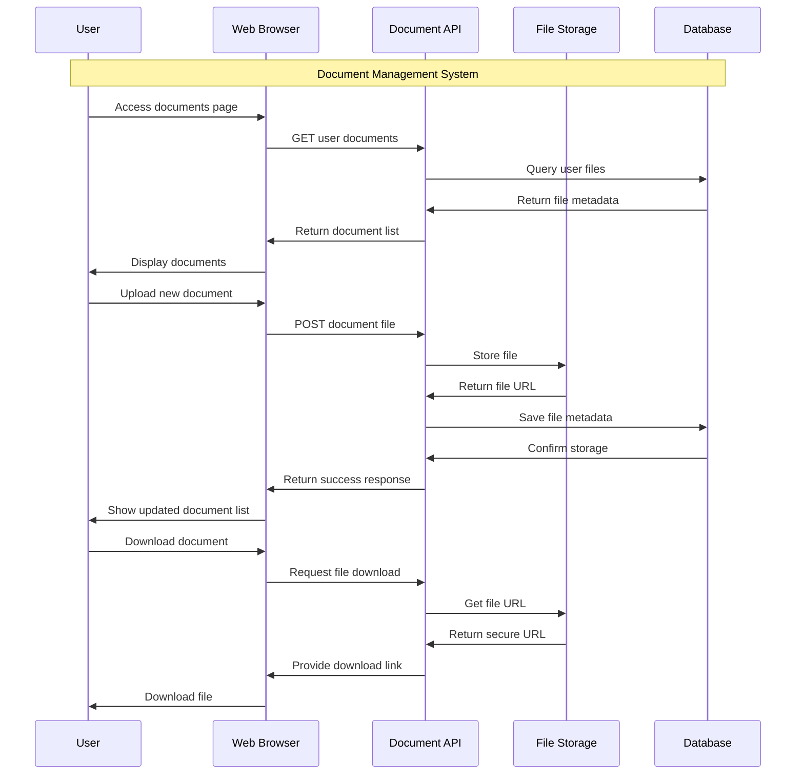
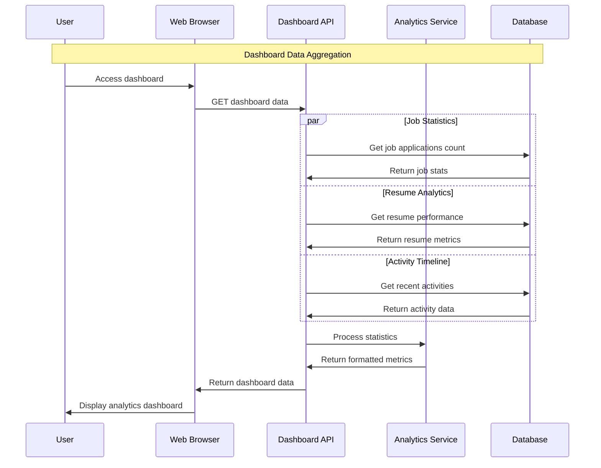

# Sequence Diagram - Silamar Application

## 1. User Authentication Flow

## 2. Job Tracking & Scraping Flow

## 3. Resume Analysis & Generation Flow

## 4. Cover Letter Generation Flow

## 5. Document Management Flow

## 6. Dashboard Analytics Flow

