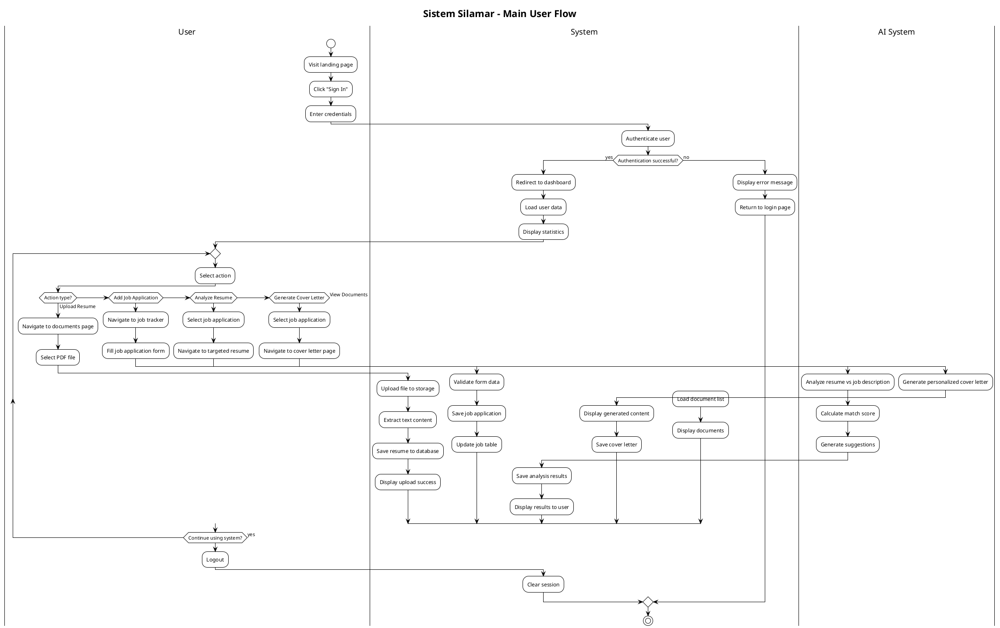
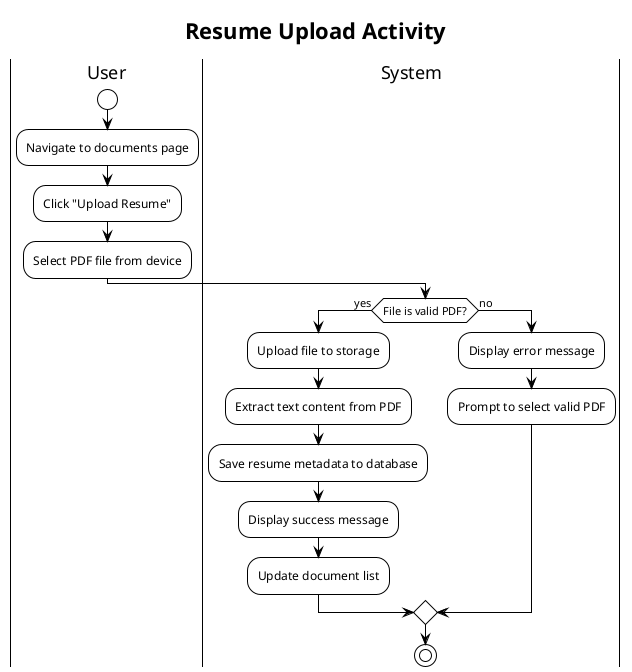
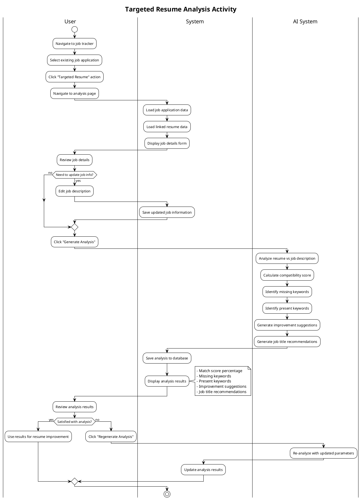
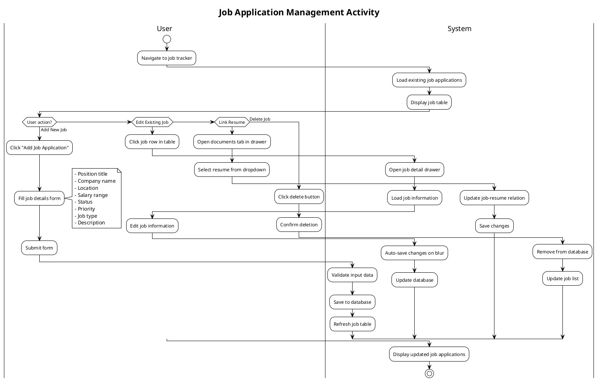
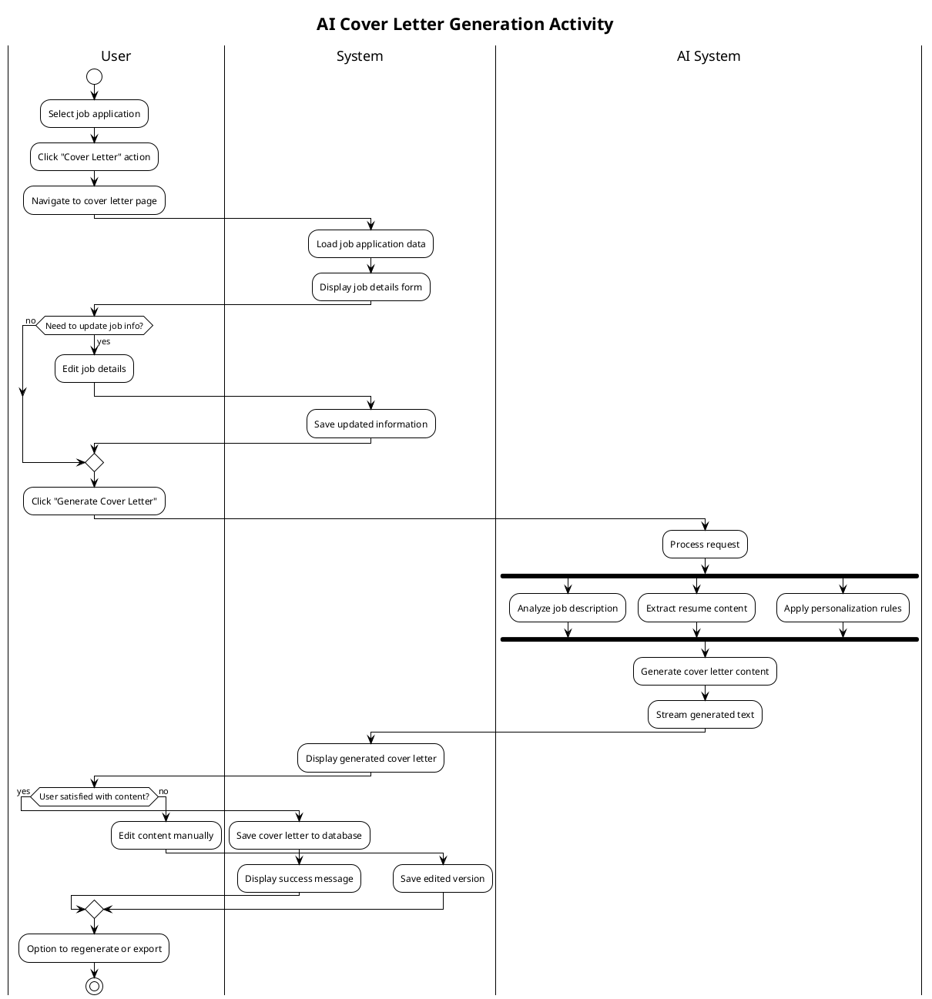
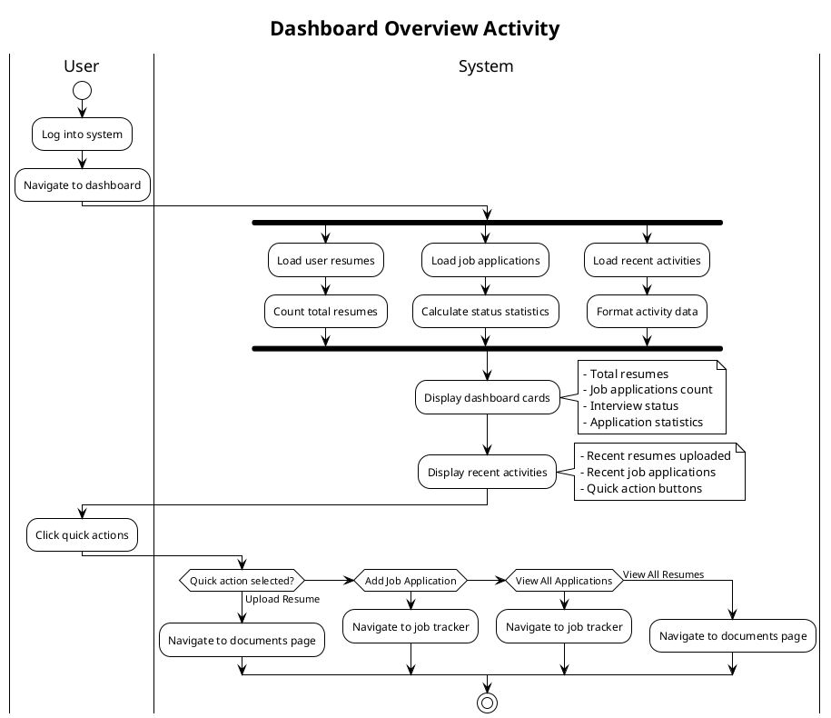
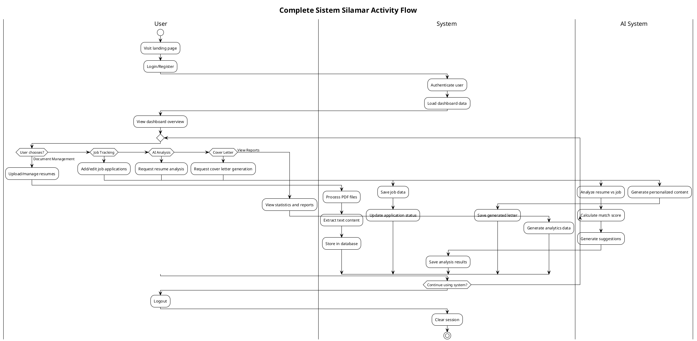

# Activity Diagram Silamar - PlantUML

## 1. Main User Flow Activity Diagram

## 2. Resume Upload Flow

## 3. Targeted Resume Analysis Flow

## 4. Job Application Management Flow

## 5. AI Cover Letter Generation Flow

## 6. Dashboard Overview Flow

## 7. Complete System Activity Flow

