# Diagram Navigasi Silamar - Mermaid.js

## 1. Struktur Navigasi Utama

```mermaid
graph TB
    %% Landing Page
    Landing[🏠 Landing Page<br/>"/"]

    %% Authentication
    Auth[🔐 Authentication<br/>"/auth"]

    %% Dashboard Root
    Dashboard[📊 Dashboard<br/>"/dashboard"]

    %% Main Features
    Documents[📄 Documents<br/>"/documents"]
    JobTracker[📋 Job Tracker<br/>"/job-tracker"]
    TargetedResume[🎯 Targeted Resume<br/>"/targeted-resume"]
    CoverLetter[📝 Cover Letter<br/>"/cover-letter"]

    %% Landing Page Navigation
    Landing --> Auth
    Landing --> Dashboard

    %% Authentication Flow
    Auth --> Dashboard

    %% Dashboard Navigation
    Dashboard --> Documents
    Dashboard --> JobTracker
    Dashboard --> TargetedResume
    Dashboard --> CoverLetter

    %% Styling
    classDef landingClass fill:#f9f9f9,stroke:#333,stroke-width:2px
    classDef authClass fill:#fff2cc,stroke:#d6b656,stroke-width:2px
    classDef dashboardClass fill:#d5e8d4,stroke:#82b366,stroke-width:2px
    classDef featureClass fill:#dae8fc,stroke:#6c8ebf,stroke-width:2px

    class Landing landingClass
    class Auth authClass
    class Dashboard dashboardClass
    class Documents,JobTracker,TargetedResume,CoverLetter featureClass
```

## 2. Struktur Sidebar Navigation

```mermaid
graph TD
    %% Sidebar Structure
    Sidebar[🔧 App Sidebar]

    %% Header Section
    SidebarHeader[📌 Sidebar Header<br/>TeamSwitcher - Silamar]

    %% Content Section
    SidebarContent[📋 Sidebar Content<br/>Navigation Projects]

    %% Footer Section
    SidebarFooter[👤 Sidebar Footer<br/>User Profile Menu]

    %% Navigation Projects
    NavDashboard[📊 Dashboard<br/>"/dashboard"]
    NavDocuments[📄 Documents<br/>"/documents"]
    NavJobTracker[📋 Job Tracker<br/>"/job-tracker"]

    %% User Menu Items
    UserProfile[👤 User Profile]
    SignOut[🚪 Sign Out]

    %% Relationships
    Sidebar --> SidebarHeader
    Sidebar --> SidebarContent
    Sidebar --> SidebarFooter

    SidebarContent --> NavDashboard
    SidebarContent --> NavDocuments
    SidebarContent --> NavJobTracker

    SidebarFooter --> UserProfile
    SidebarFooter --> SignOut

    %% Styling
    classDef sidebarClass fill:#f8f9fa,stroke:#6c757d,stroke-width:2px
    classDef sectionClass fill:#e9ecef,stroke:#6c757d,stroke-width:1px
    classDef navClass fill:#d1ecf1,stroke:#bee5eb,stroke-width:1px
    classDef userClass fill:#f8d7da,stroke:#f5c6cb,stroke-width:1px

    class Sidebar sidebarClass
    class SidebarHeader,SidebarContent,SidebarFooter sectionClass
    class NavDashboard,NavDocuments,NavJobTracker navClass
    class UserProfile,SignOut userClass
```

## 3. Routing Structure Detail


## 4. Component Navigation Flow

```mermaid
flowchart TD
    %% Landing Components
    NavbarSection[🧭 Navbar Section<br/>Navigation Bar]
    HeroSection[🎯 Hero Section<br/>Call-to-Action]

    %% Dashboard Layout Components
    AppSidebar[🔧 App Sidebar<br/>Main Navigation]
    HeaderSidebar[📌 Header Sidebar<br/>Page Title & Toggle]
    SidebarInset[📋 Sidebar Inset<br/>Main Content Area]

    %% Navigation Components
    TeamSwitcher[🏢 Team Switcher<br/>Silamar Branding]
    NavProjects[📁 Nav Projects<br/>Main Menu Items]
    NavUser[👤 Nav User<br/>User Profile Menu]

    %% Modal/Drawer Components
    DrawerWrapper[🔄 Drawer Wrapper<br/>Job Detail Drawer]
    DocumentDialog[📄 Document Dialog<br/>Document Modal]

    %% Component Relationships
    NavbarSection --> HeroSection

    AppSidebar --> TeamSwitcher
    AppSidebar --> NavProjects
    AppSidebar --> NavUser

    HeaderSidebar --> SidebarInset
    AppSidebar --> SidebarInset

    SidebarInset --> DrawerWrapper
    SidebarInset --> DocumentDialog

    %% Navigation Actions
    NavProjects --> DashboardPage
    NavProjects --> DocumentsPage
    NavProjects --> JobTrackerPage

    %% Styling
    classDef landingComp fill:#e1f5fe,stroke:#0277bd,stroke-width:2px
    classDef layoutComp fill:#f3e5f5,stroke:#7b1fa2,stroke-width:2px
    classDef navComp fill:#e8f5e8,stroke:#2e7d32,stroke-width:2px
    classDef modalComp fill:#fff3e0,stroke:#ef6c00,stroke-width:2px

    class NavbarSection,HeroSection landingComp
    class AppSidebar,HeaderSidebar,SidebarInset layoutComp
    class TeamSwitcher,NavProjects,NavUser navComp
    class DrawerWrapper,DocumentDialog modalComp
```



## 5. User Flow Navigation


## 6. Modal & Drawer Navigation


---

## Keterangan Diagram

### Fitur Navigasi Utama:

1. **Landing Page** - Halaman utama dengan navbar dan hero section
2. **Authentication** - Halaman login/register
3. **Dashboard** - Halaman utama setelah login dengan overview
4. **Documents** - Manajemen dokumen resume
5. **Job Tracker** - Pelacakan aplikasi pekerjaan
6. **Targeted Resume** - Pembuatan resume yang disesuaikan
7. **Cover Letter** - Pembuatan surat lamaran

### Komponen Navigasi:

- **App Sidebar** - Navigation utama dengan menu projek
- **Header Sidebar** - Header dengan toggle sidebar dan judul halaman
- **Team Switcher** - Branding aplikasi
- **Nav Projects** - Menu navigasi utama
- **Nav User** - Menu profil pengguna

### Modal & Drawer:

- **Drawer Wrapper** - Detail pekerjaan dalam bentuk drawer
- **Document Dialog** - Modal untuk detail dokumen
- **Tabs Navigation** - Navigasi tab dalam drawer/modal

Diagram ini menunjukkan struktur navigasi lengkap dari aplikasi Silamar, termasuk routing, komponen, dan alur pengguna.
