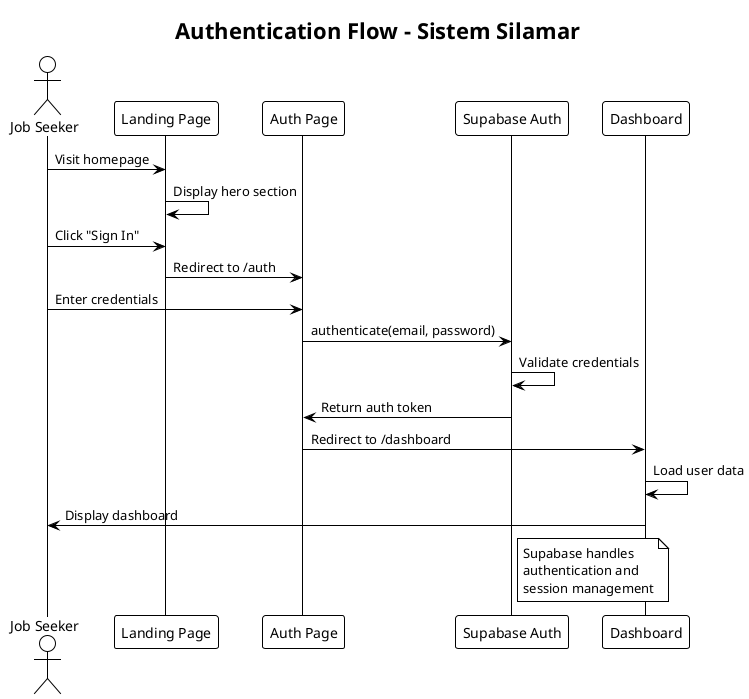
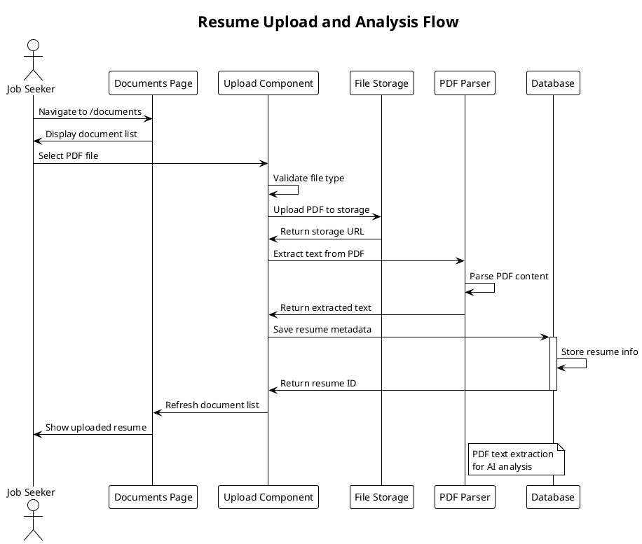
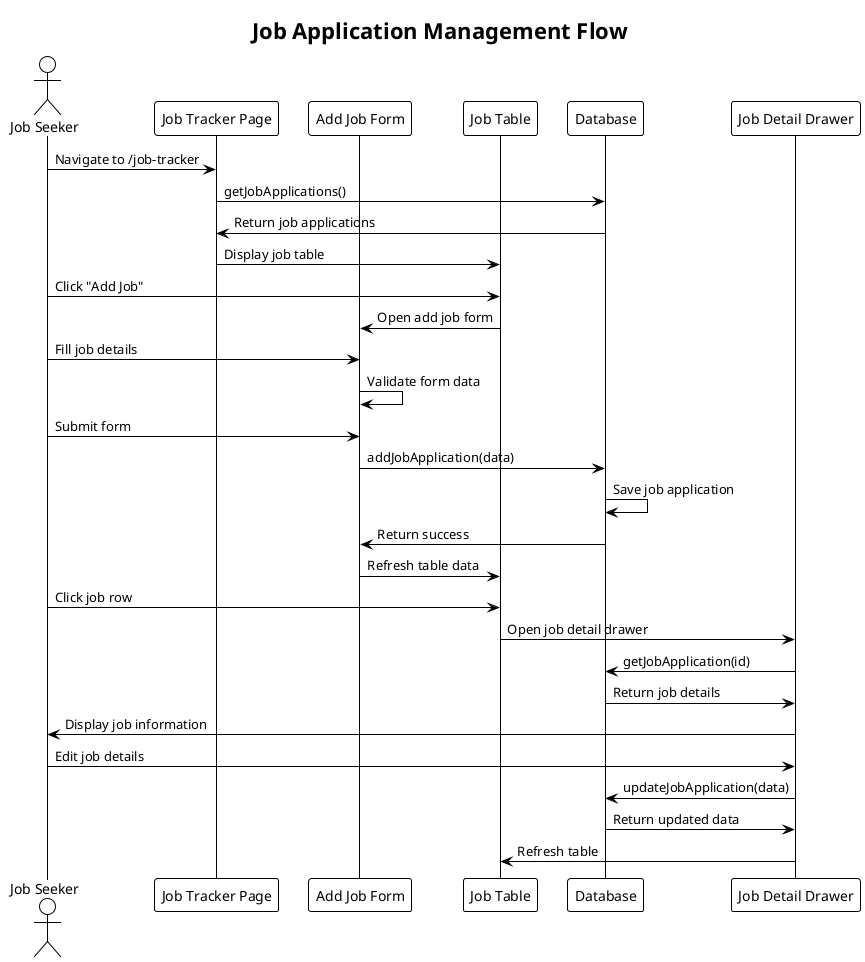
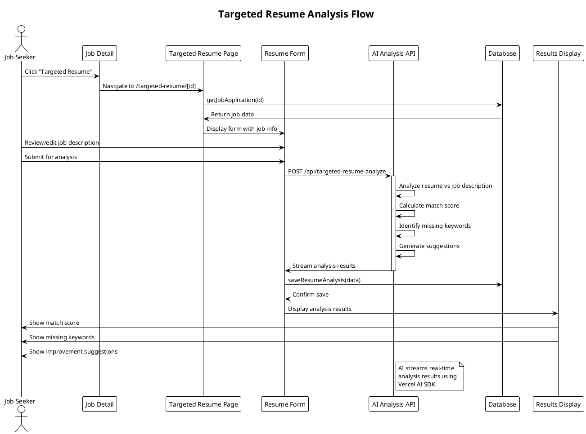
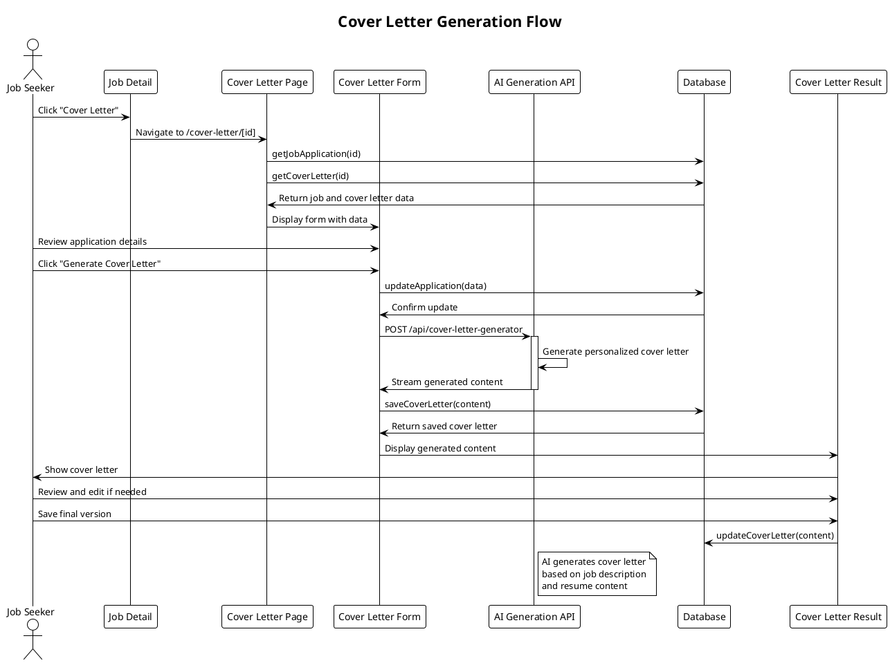
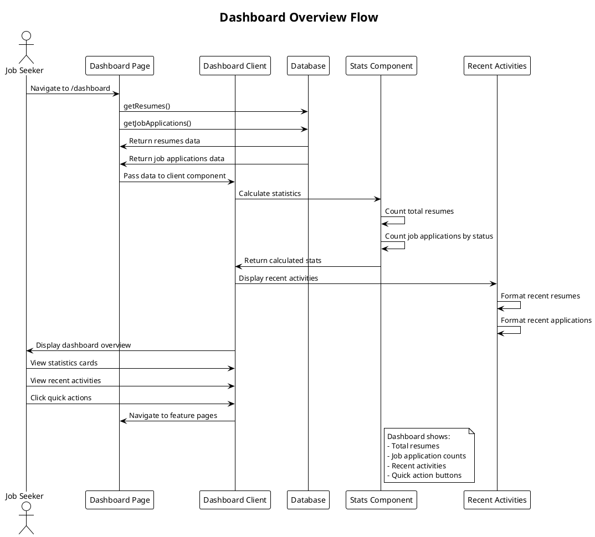
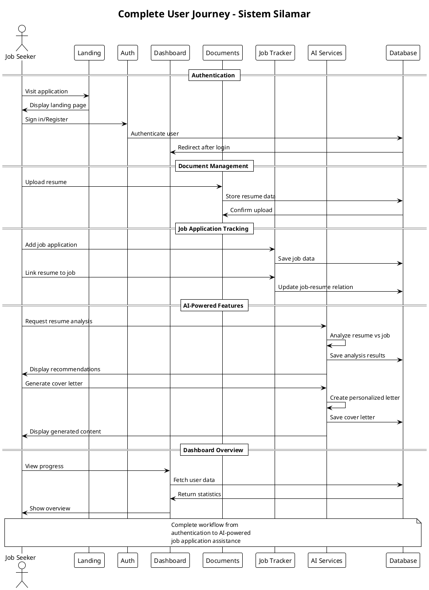

# Sequence Diagram Silamar - PlantUML

## 1. Authentication Flow



## 2. Resume Upload and Analysis Flow



## 3. Job Application Management Flow



## 4. Targeted Resume Analysis Flow



## 5. Cover Letter Generation Flow



## 6. Dashboard Overview Flow



## 7. Document Management Flow

```plantuml
@startuml
!theme plain
title Document Management Flow

actor "Job Seeker" as User
participant "Documents Page" as DocsPage
participant "Document List" as DocList
participant "Document Detail" as DocDetail
participant "PDF Viewer" as Viewer
participant "Database" as DB

User -> DocsPage: Navigate to /documents
DocsPage -> DB: getResumes()
DB -> DocsPage: Return resume list
DocsPage -> DocList: Display document grid

User -> DocList: Click document card
DocList -> DocDetail: Navigate to /documents/[id]

DocDetail -> DB: getResume(id)
DB -> DocDetail: Return resume data
DocDetail -> Viewer: Load PDF viewer

Viewer -> Viewer: Render PDF pages
Viewer -> User: Display document content

User -> DocDetail: View document details
User -> DocDetail: Click "Analyze" button
DocDetail -> DocsPage: Navigate to analysis

alternative Delete Document
    User -> DocDetail: Click delete button
    DocDetail -> DocDetail: Show confirmation dialog
    User -> DocDetail: Confirm deletion
    DocDetail -> DB: deleteResume(id)
    DB -> DocDetail: Confirm deletion
    DocDetail -> DocsPage: Navigate back to list
end

@enduml
```

## 8. Complete User Journey Flow



---

## Penjelasan Sequence Diagrams untuk Skripsi

### 1. Penjelasan Authentication Flow

**Sequence Diagram Authentication Flow** menggambarkan proses autentikasi pengguna dalam sistem Silamar. Diagram ini menunjukkan alur kerja dari saat pengguna mengunjungi halaman utama hingga berhasil masuk ke dashboard.

**Aktor yang Terlibat:**

- **Job Seeker**: Pengguna yang ingin mengakses sistem
- **Landing Page**: Halaman utama aplikasi
- **Auth Page**: Halaman autentikasi
- **Supabase Auth**: Layanan autentikasi eksternal
- **Dashboard**: Halaman utama setelah login

**Alur Proses:**

1. Pengguna mengunjungi halaman utama dan melihat hero section
2. Pengguna mengklik tombol "Sign In" untuk memulai proses autentikasi
3. Sistem mengarahkan pengguna ke halaman autentikasi (/auth)
4. Pengguna memasukkan kredensial (email dan password)
5. Sistem mengirim data kredensial ke Supabase Auth untuk validasi
6. Supabase Auth memvalidasi kredensial dan mengembalikan token autentikasi
7. Setelah autentikasi berhasil, sistem mengarahkan pengguna ke dashboard
8. Dashboard memuat data pengguna dan menampilkan interface utama

**Keamanan dan Session Management:**
Diagram ini menunjukkan bahwa sistem menggunakan Supabase sebagai provider autentikasi, yang menyediakan keamanan tingkat enterprise dan session management otomatis.

### 2. Penjelasan Resume Upload and Analysis Flow

**Sequence Diagram Resume Upload and Analysis Flow** mendemonstrasikan proses pengunggahan dan pemrosesan dokumen resume dalam sistem. Diagram ini menunjukkan bagaimana sistem menangani file PDF dan mempersiapkannya untuk analisis AI.

**Komponen yang Terlibat:**

- **User**: Pengguna yang mengunggah resume
- **Documents Page**: Interface manajemen dokumen
- **Upload Component**: Komponen pengunggahan file
- **File Storage**: Sistem penyimpanan file
- **PDF Parser**: Parser untuk ekstraksi teks
- **Database**: Basis data untuk metadata

**Tahapan Proses:**

1. **Navigasi**: Pengguna mengakses halaman dokumen dan melihat daftar dokumen yang ada
2. **Seleksi File**: Pengguna memilih file PDF yang akan diunggah
3. **Validasi**: Sistem memvalidasi tipe file untuk memastikan format yang didukung
4. **Upload Storage**: File diunggah ke sistem penyimpanan dan mendapat URL unik
5. **Ekstraksi Teks**: PDF Parser mengekstrak konten teks dari file untuk keperluan analisis AI
6. **Penyimpanan Metadata**: Informasi resume disimpan dalam database termasuk URL storage dan teks terekstrak
7. **Update Interface**: Daftar dokumen diperbarui untuk menampilkan resume yang baru diunggah

**Teknologi yang Digunakan:**
Proses ini mengintegrasikan teknologi cloud storage untuk file management dan PDF parsing library untuk ekstraksi teks otomatis.

### 3. Penjelasan Job Application Management Flow

**Sequence Diagram Job Application Management Flow** mengilustrasikan sistem manajemen aplikasi pekerjaan yang komprehensif, mencakup operasi CRUD (Create, Read, Update, Delete) dan interaksi real-time.

**Entitas Utama:**

- **User**: Pengguna yang mengelola aplikasi pekerjaan
- **Job Tracker Page**: Halaman utama pelacakan pekerjaan
- **Add Job Form**: Form penambahan pekerjaan baru
- **Job Table**: Tabel untuk menampilkan daftar pekerjaan
- **Database**: Penyimpanan data aplikasi pekerjaan
- **Job Detail Drawer**: Panel detail pekerjaan

**Skenario Penggunaan:**

1. **Load Data**: Sistem memuat daftar aplikasi pekerjaan dari database dan menampilkannya dalam tabel
2. **Tambah Pekerjaan**: Pengguna mengklik "Add Job" untuk membuka form penambahan
3. **Input Data**: Pengguna mengisi detail pekerjaan (posisi, perusahaan, status, prioritas)
4. **Validasi dan Simpan**: Form melakukan validasi data dan menyimpannya ke database
5. **Refresh Interface**: Tabel diperbarui untuk menampilkan data terbaru
6. **View Detail**: Pengguna dapat mengklik baris untuk membuka detail dalam drawer
7. **Edit Data**: Pengguna dapat mengedit informasi pekerjaan melalui drawer
8. **Real-time Update**: Perubahan langsung disimpan dan direfleksikan dalam interface

**Keunggulan Sistem:**
Diagram menunjukkan sistem yang responsif dengan update real-time dan interface yang user-friendly untuk manajemen data pekerjaan.

### 4. Penjelasan Targeted Resume Analysis Flow

**Sequence Diagram Targeted Resume Analysis Flow** mendemonstrasikan fitur unggulan sistem berupa analisis resume berbasis AI yang disesuaikan dengan deskripsi pekerjaan tertentu.

**Komponen AI Analysis:**

- **Resume Form**: Interface input dan konfigurasi analisis
- **AI Analysis API**: Endpoint untuk pemrosesan AI
- **Results Display**: Tampilan hasil analisis

**Proses Analisis Mendalam:**

1. **Inisiasi**: Pengguna mengakses fitur analisis melalui detail pekerjaan
2. **Load Context**: Sistem memuat data aplikasi pekerjaan yang akan dianalisis
3. **Review Input**: Pengguna dapat meninjau dan mengedit deskripsi pekerjaan
4. **Trigger Analysis**: Sistem mengirim request ke AI Analysis API
5. **AI Processing**:
   - Membandingkan resume dengan job description
   - Menghitung skor kesesuaian (match score)
   - Mengidentifikasi keyword yang hilang
   - Menghasilkan saran perbaikan spesifik
6. **Streaming Results**: Hasil analisis di-stream secara real-time menggunakan Vercel AI SDK
7. **Persistence**: Hasil analisis disimpan untuk referensi masa depan
8. **Visualization**: Data ditampilkan dalam format yang mudah dipahami

**Teknologi AI:**
Sistem menggunakan model AI untuk natural language processing yang dapat memahami konteks pekerjaan dan memberikan analisis yang relevan dan actionable.

### 5. Penjelasan Cover Letter Generation Flow

**Sequence Diagram Cover Letter Generation Flow** menunjukkan proses otomatisasi pembuatan surat lamaran yang dipersonalisasi menggunakan teknologi AI generatif.

**Tahapan Generasi Content:**

1. **Context Loading**: Sistem memuat data aplikasi pekerjaan dan surat lamaran yang sudah ada (jika ada)
2. **Data Review**: Pengguna meninjau dan dapat mengedit informasi aplikasi
3. **Content Generation**: AI menghasilkan surat lamaran yang dipersonalisasi berdasarkan:
   - Job description
   - Konten resume
   - Informasi perusahaan
   - Template yang sesuai
4. **Real-time Streaming**: Konten di-generate secara streaming untuk pengalaman yang responsif
5. **Content Management**: Pengguna dapat meninjau, mengedit, dan menyimpan hasil

**Personalisasi AI:**
Sistem AI menganalisis job description dan resume untuk menciptakan surat lamaran yang:

- Relevan dengan posisi yang dilamar
- Menyoroti kualifikasi yang sesuai
- Menggunakan tone dan struktur yang profesional
- Disesuaikan dengan budaya perusahaan

### 6. Penjelasan Dashboard Overview Flow

**Sequence Diagram Dashboard Overview Flow** mengilustrasikan sistem dashboard yang memberikan ringkasan komprehensif aktivitas dan statistik pengguna.

**Komponen Dashboard:**

- **Dashboard Client**: Komponen utama yang mengatur tampilan
- **Stats Component**: Penghitung statistik otomatis
- **Recent Activities**: Tampilan aktivitas terbaru

**Informasi yang Disajikan:**

1. **Statistik Resume**: Jumlah total resume yang telah diunggah
2. **Status Aplikasi**: Breakdown aplikasi pekerjaan berdasarkan status (applied, interview, rejected, accepted)
3. **Aktivitas Terbaru**: Daftar resume dan aplikasi pekerjaan terbaru
4. **Quick Actions**: Tombol akses cepat ke fitur-fitur utama

**Real-time Analytics:**
Dashboard melakukan kalkulasi statistik secara dinamis dan menyajikan data dalam format yang visual dan informatif.

### 7. Penjelasan Document Management Flow

**Sequence Diagram Document Management Flow** menggambarkan sistem manajemen dokumen yang komprehensif dengan fitur viewing, editing, dan deletion.

**Fitur Manajemen:**

1. **Document Grid**: Tampilan grid untuk browsing dokumen
2. **PDF Viewer**: Viewer terintegrasi untuk melihat konten dokumen
3. **Document Operations**: Fungsi view, analyze, dan delete
4. **Confirmation Dialogs**: Konfirmasi untuk operasi destruktif

**User Experience:**
Sistem menyediakan interface yang intuitif untuk manajemen dokumen dengan preview real-time dan navigasi yang smooth.

### 8. Penjelasan Complete User Journey Flow

**Sequence Diagram Complete User Journey Flow** menyajikan gambaran end-to-end pengalaman pengguna dalam sistem Silamar, menunjukkan integrasi semua fitur utama.

**Journey Phases:**

1. **Authentication Phase**: Proses masuk ke sistem
2. **Document Management Phase**: Pengelolaan resume dan dokumen
3. **Job Application Tracking Phase**: Pelacakan dan manajemen aplikasi pekerjaan
4. **AI-Powered Features Phase**: Penggunaan fitur analisis dan generasi AI
5. **Dashboard Overview Phase**: Monitoring progress dan statistik

**Value Proposition:**
Diagram ini mendemonstrasikan bagaimana sistem Silamar memberikan value end-to-end dari upload resume hingga optimasi aplikasi pekerjaan menggunakan AI, menciptakan workflow yang seamless dan efisien untuk job seekers.

**Integrasi Teknologi:**
Journey ini menunjukkan integrasi berbagai teknologi modern termasuk AI/ML, cloud storage, real-time data processing, dan responsive UI/UX untuk menciptakan pengalaman pengguna yang superior dalam pencarian kerja.
