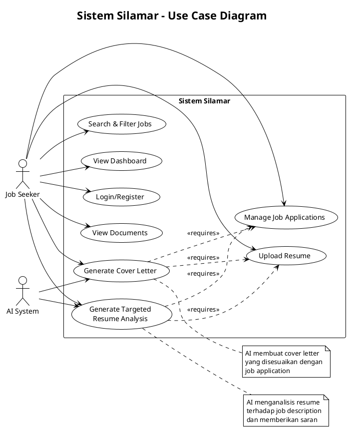

# Use Case Diagram Silamar - Mermaid.js

## Use Case Diagram Utama

## Deskripsi Use Cases

### Login/Register

**Aktor**: Job Seeker  
**Deskripsi**: User melakukan autentikasi untuk mengakses sistem Silamar

### Upload Resume

**Aktor**: Job Seeker  
**Deskripsi**: User mengunggah file resume dalam format PDF untuk dianalisis sistem

### View Documents

**Aktor**: Job Seeker  
**Deskripsi**: User melihat dan mengelola dokumen resume yang telah diunggah

### Manage Job Applications

**Aktor**: Job Seeker  
**Deskripsi**: User menambah, mengedit, dan menghapus data aplikasi pekerjaan

### Search & Filter Jobs

**Aktor**: Job Seeker  
**Deskripsi**: User mencari dan memfilter aplikasi pekerjaan berdasarkan kriteria tertentu

### Generate Targeted Resume Analysis

**Aktor**: Job Seeker, AI System  
**Deskripsi**: Sistem AI menganalisis resume terhadap job description dan memberikan saran perbaikan

### Generate Cover Letter

**Aktor**: Job Seeker, AI System  
**Deskripsi**: Sistem AI membuat cover letter yang disesuaikan dengan job application

### View Dashboard

**Aktor**: Job Seeker  
**Deskripsi**: User melihat ringkasan statistik aplikasi pekerjaan dan aktivitas terbaru

## Aktor dalam Sistem

### 👤 Job Seeker

- **Peran**: Pengguna utama aplikasi Silamar
- **Tanggung jawab**: Mengelola resume, melacak aplikasi pekerjaan, menggunakan fitur AI

### 🤖 AI System

- **Peran**: Sistem kecerdasan buatan
- **Tanggung jawab**: Menganalisis resume, memberikan saran, dan generate cover letter

## Services dalam Sistem

### Authentication

- Mengelola login dan registrasi user
- Verifikasi identitas pengguna

### Document Management

- Mengelola upload dan storage resume
- Ekstraksi teks dari PDF

### Job Management

- Mengelola data aplikasi pekerjaan
- CRUD operations untuk job applications

### AI Analysis

- Analisis resume menggunakan AI
- Generate cover letter otomatis
- Perhitungan match score

### Dashboard

- Menampilkan statistik dan laporan
- Interface untuk quick actions
